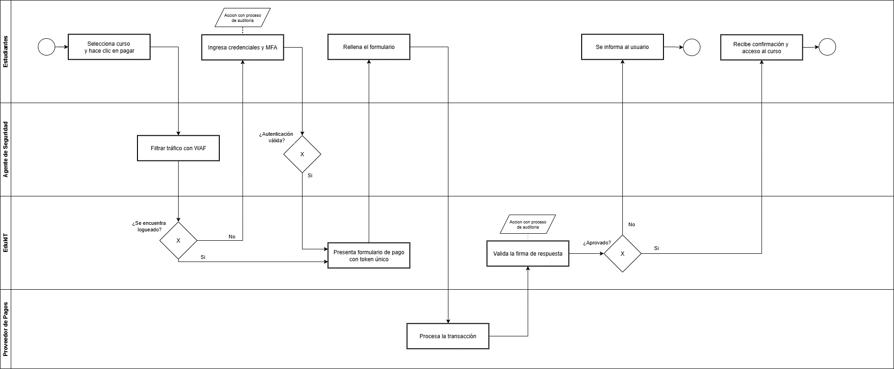

# 🗒️ Registro de Trabajo en Clase - Taller 5

## 📆 Fecha de la sesión
_13 de septiembre del 2025._

## 👥 Integrantes presentes
- Samuel Esptia Cruz
- Edwin ALejandro Gutierrez Rodriguez
- Nicolas Stiven Ortiz Cortes

## 🧠 Actividades realizadas en clase

Durante la sesión se discutieron los posibles flujos críticos de la plataforma EdukIT y se concluyó que el procesamiento de pagos con terceros era el más relevante para analizar con STRIDE, debido a que maneja datos sensibles como información personal, medios de pago y accesos a cursos. El equipo identificó las amenazas más críticas en este flujo (suplantación de identidad, manipulación de datos, divulgación de información y ataques de denegación de servicio) y propuso medidas de mitigación como autenticación multifactor, cifrado, firmas digitales, control de accesos, WAF y monitoreo continuo.

En cuanto al modelado, se tomó la decisión de representar el flujo en BPMN con cuatro agentes principales: Estudiante, EdukIT, Proveedor de Pagos y Agente de Seguridad. Se acordó que la validación de la firma digital de las transacciones debía realizarse dentro del back-end de EdukIT, mientras que el Agente de Seguridad cumpliría un rol paralelo de supervisión, auditoría, uso de WAF y monitoreo de anomalías. Además, se establecieron dos eventos de finalización distintos: uno para el pago exitoso (que habilita el curso) y otro para el pago rechazado (que genera notificación al usuario).

Las herramientas empleadas fueron papel y pizarra para el boceto inicial, Excel para la construcción de la tabla STRIDE y draw.io para el modelado BPMN final.

Durante la sesión se alcanzó a desarrollar por completo la tabla STRIDE con valoración de impacto, así como un modelo preliminar en BPMN que ya incluye los agentes, actividades principales, gateways de decisión, validación de firma en EdukIT y la incorporación del WAF y el monitoreo como procesos de seguridad paralelos. El trabajo pendiente se centra en ajustar el estilo del diagrama y documentar los resultados en los entregables finales del taller.

## 🧩 Boceto inicial del modelo

## 🔁 Tareas definidas para complementar el taller

Responsabilidades acordadas entre los miembros del equipo para completar la entrega final:

| Tarea asignada | Responsable | Fecha estimada |
|----------------|-------------|----------------|
| Completar y validar tabla STRIDE| Edwin Guiterrez | 13/08 |
| Modelado final en draw.io | Samuel Espitia | 13/08 |
| Redacción del informe     | Nicolas Ortiz | 13/08 |
| Revisión del BPMN y STRIDE | Nicolas Ortiz | 14/08 |

---

_Este documento resume el trabajo colaborativo realizado durante la sesión del taller 5 en el curso AREM - Universidad de La Sabana._
